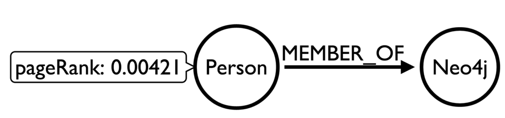
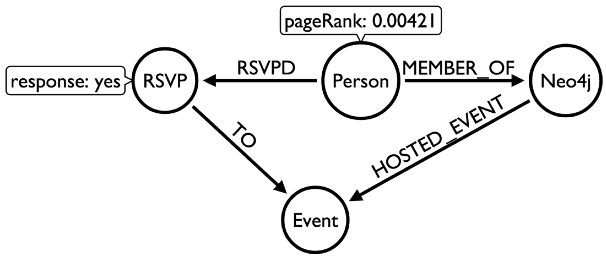

Querying the blended graph
========================================================


```r
library(RNeo4j)
library(dplyr)
```


```r
graph = startGraph("http://localhost:7474/db/data/")
options(width = 200)
options("scipen"=100, "digits"=4)
```

### Which of the most influential meetup members are in the Neo4j group?




```r
query = "MATCH (p:MeetupProfile)
         WITH p 
         ORDER BY p.pageRank DESC
         LIMIT 20
         OPTIONAL MATCH member =  (p)-[m:MEMBER_OF]->(g:Group)
         WHERE g.name = 'Neo4j - London User Group'
         RETURN p.name, p.id, p.pageRank,  NOT m is null AS isMember
         ORDER BY p.pageRank DESC"

cypher(graph, query)
```

```
##                   p.name     p.id p.pageRank isMember
## 1                  louis 41493372   0.003217     TRUE
## 2  Kannappan Sirchabesan  1797906   0.002845    FALSE
## 3              zheng zhu 44517222   0.002684     TRUE
## 4             Amit Nandi 38680722   0.002505     TRUE
## 5         Enzo Martoglio 38546232   0.002446     TRUE
## 6             Raja Kolli 42900792   0.002336     TRUE
## 7         Anish Mohammed 12569718   0.002298     TRUE
## 8           Peter Morgan 13483828   0.002232     TRUE
## 9    Deepak Subhramanian 35662872   0.002125     TRUE
## 10            Ricki Long 14327689   0.001976     TRUE
## 11                 Rohit 48230152   0.001965     TRUE
## 12         Peter Lindsey 28435312   0.001905    FALSE
## 13           Ryadh Khsib 31153292   0.001841    FALSE
## 14          sahera kadim 11290744   0.001794     TRUE
## 15       Gourav Sengupta 29800182   0.001754     TRUE
## 16         Bruno Bonacci 30439342   0.001729    FALSE
## 17              Ali Syed 39676622   0.001642    FALSE
## 18          Manu Marchal  8488984   0.001624    FALSE
## 19                Marcin 13126749   0.001553    FALSE
## 20         JUNIOR SAYLES 37101202   0.001545     TRUE
```

### Which of the most influential meetup members have attended a Neo4j meetup?




```r
query = "MATCH (p:MeetupProfile)
         WITH p 
         ORDER BY p.pageRank DESC
         LIMIT 20
         OPTIONAL MATCH member =  (p)-[m:MEMBER_OF]->(g:Group {name: 'Neo4j - London User Group'})
         WITH p, NOT m is null AS isMember, g
         OPTIONAL MATCH event= (p)-[:RSVPD]-({response: 'yes'})-[:TO]->()<-[:HOSTED_EVENT]-(g)
         WITH p,  isMember, COLLECT(event) as events
         RETURN p.name, p.id, p.pageRank,   isMember, LENGTH(events) AS events
         ORDER BY p.pageRank DESC"

cypher(graph, query)
```

```
##                   p.name     p.id p.pageRank isMember events
## 1                  louis 41493372   0.003217     TRUE     15
## 2  Kannappan Sirchabesan  1797906   0.002845    FALSE      0
## 3              zheng zhu 44517222   0.002684     TRUE      5
## 4             Amit Nandi 38680722   0.002505     TRUE     16
## 5         Enzo Martoglio 38546232   0.002446     TRUE     12
## 6             Raja Kolli 42900792   0.002336     TRUE     17
## 7         Anish Mohammed 12569718   0.002298     TRUE      9
## 8           Peter Morgan 13483828   0.002232     TRUE     20
## 9    Deepak Subhramanian 35662872   0.002125     TRUE      4
## 10            Ricki Long 14327689   0.001976     TRUE      9
## 11                 Rohit 48230152   0.001965     TRUE     11
## 12         Peter Lindsey 28435312   0.001905    FALSE      0
## 13           Ryadh Khsib 31153292   0.001841    FALSE      0
## 14          sahera kadim 11290744   0.001794     TRUE     20
## 15       Gourav Sengupta 29800182   0.001754     TRUE      5
## 16         Bruno Bonacci 30439342   0.001729    FALSE      0
## 17              Ali Syed 39676622   0.001642    FALSE      0
## 18          Manu Marchal  8488984   0.001624    FALSE      0
## 19                Marcin 13126749   0.001553    FALSE      0
## 20         JUNIOR SAYLES 37101202   0.001545     TRUE      6
```
