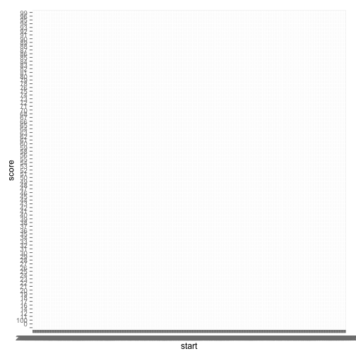

```r
library(dplyr)
googleTrends = read.csv("/Users/markneedham/Downloads/report.csv", row.names=NULL)
```

```r
googleTrends %>% head()
```

```
##                   row.names Web.Search.interest..neo4j
## 1 Worldwide; 2004 - present                           
## 2        Interest over time                           
## 3                      Week                      neo4j
## 4   2004-01-04 - 2004-01-10                          0
## 5   2004-01-11 - 2004-01-17                          0
## 6   2004-01-18 - 2004-01-24                          0
```

```r
googleTrends %>% sample_n(10)
```

```
##                   row.names Web.Search.interest..neo4j
## 100 2005-11-06 - 2005-11-12                          0
## 105 2005-12-11 - 2005-12-17                          0
## 481 2013-02-24 - 2013-03-02                         58
## 94  2005-09-25 - 2005-10-01                          0
## 480 2013-02-17 - 2013-02-23                         65
## 455 2012-08-26 - 2012-09-01                         64
## 3                      Week                      neo4j
## 391 2011-06-05 - 2011-06-11                         37
## 534 2014-03-02 - 2014-03-08                         83
## 370 2011-01-09 - 2011-01-15                         20
```

```r
googleTrends %>% tail()
```

```
##                row.names Web.Search.interest..neo4j
## 658        neo4j example                   Breakout
## 659 neo4j graph database                   Breakout
## 660           neo4j java                   Breakout
## 661           neo4j node                   Breakout
## 662           neo4j rest                   Breakout
## 663       neo4j tutorial                   Breakout
```


```r
names(googleTrends) = c("week", "score")
```


```r
googleTrends %>% 
  mutate(ind = row_number()) %>% 
  group_by(ind) %>%
  mutate(dates = strsplit(week, " - "),
         start = dates[[1]][1] %>% strptime("%Y-%m-%d") %>% as.character(),
         end =   dates[[1]][2] %>% strptime("%Y-%m-%d") %>% as.character()) %>%
  head()
```

```
## Source: local data frame [6 x 6]
## Groups: ind
## 
##                        week score ind    dates      start        end
## 1 Worldwide; 2004 - present         1 <chr[2]>         NA         NA
## 2        Interest over time         2 <chr[1]>         NA         NA
## 3                      Week neo4j   3 <chr[1]>         NA         NA
## 4   2004-01-04 - 2004-01-10     0   4 <chr[2]> 2004-01-04 2004-01-10
## 5   2004-01-11 - 2004-01-17     0   5 <chr[2]> 2004-01-11 2004-01-17
## 6   2004-01-18 - 2004-01-24     0   6 <chr[2]> 2004-01-18 2004-01-24
```


```r
googleTrends %>% 
  mutate(ind = row_number()) %>% 
  group_by(ind) %>%
  mutate(dates = strsplit(week, " - "),
         start = dates[[1]][1] %>% strptime("%Y-%m-%d") %>% as.character(),
         end =   dates[[1]][2] %>% strptime("%Y-%m-%d") %>% as.character()) %>%
  filter(!is.na(start) | !is.na(end)) %>% 
  head()
```

```
## Source: local data frame [6 x 6]
## Groups: ind
## 
##                      week score ind    dates      start        end
## 1 2004-01-04 - 2004-01-10     0   4 <chr[2]> 2004-01-04 2004-01-10
## 2 2004-01-11 - 2004-01-17     0   5 <chr[2]> 2004-01-11 2004-01-17
## 3 2004-01-18 - 2004-01-24     0   6 <chr[2]> 2004-01-18 2004-01-24
## 4 2004-01-25 - 2004-01-31     0   7 <chr[2]> 2004-01-25 2004-01-31
## 5 2004-02-01 - 2004-02-07     0   8 <chr[2]> 2004-02-01 2004-02-07
## 6 2004-02-08 - 2004-02-14     0   9 <chr[2]> 2004-02-08 2004-02-14
```


```r
cleanGoogleTrends = googleTrends %>% 
  mutate(ind = row_number()) %>% 
  group_by(ind) %>%
  mutate(dates = strsplit(week, " - "),
         start = dates[[1]][1] %>% strptime("%Y-%m-%d") %>% as.character(),
         end =   dates[[1]][2] %>% strptime("%Y-%m-%d") %>% as.character()) %>%
  filter(!is.na(start) | !is.na(end)) %>%
  ungroup() %>%
  select(-c(ind, dates, week))

cleanGoogleTrends %>% head()
```

```
## Source: local data frame [6 x 3]
## 
##   score      start        end
## 1     0 2004-01-04 2004-01-10
## 2     0 2004-01-11 2004-01-17
## 3     0 2004-01-18 2004-01-24
## 4     0 2004-01-25 2004-01-31
## 5     0 2004-02-01 2004-02-07
## 6     0 2004-02-08 2004-02-14
```

```r
cleanGoogleTrends %>% sample_n(10)
```

```
## Source: local data frame [10 x 3]
## 
##    score      start        end
## 1     43 2012-09-02 2012-09-08
## 2      0 2008-07-06 2008-07-12
## 3     33 2011-09-04 2011-09-10
## 4     42 2011-10-23 2011-10-29
## 5     56 2012-08-12 2012-08-18
## 6     16 2010-08-29 2010-09-04
## 7     17 2010-03-21 2010-03-27
## 8     83 2014-10-05 2014-10-11
## 9      0 2007-10-28 2007-11-03
## 10     0 2004-06-27 2004-07-03
```

```r
cleanGoogleTrends %>% tail()
```

```
## Source: local data frame [6 x 3]
## 
##   score      start        end
## 1    89 2014-10-19 2014-10-25
## 2    89 2014-10-26 2014-11-01
## 3    93 2014-11-02 2014-11-08
## 4    90 2014-11-09 2014-11-15
## 5    92 2014-11-16 2014-11-22
## 6       2014-11-23 2014-11-29
```


```r
library(ggplot2)
ggplot(aes(x = start, y = score), data = cleanGoogleTrends) + 
  geom_line(size = 0.5)
```

```
## geom_path: Each group consist of only one observation. Do you need to adjust the group aesthetic?
```

 


```r
cleanGoogleTrends = cleanGoogleTrends %>% mutate(start =  as.Date(start))
ggplot(aes(x = start, y = score), data = cleanGoogleTrends) + 
  geom_line(size = 0.5)
```

 


```r
class(cleanGoogleTrends$score)
```

```
## [1] "factor"
```


```r
cleanGoogleTrends = cleanGoogleTrends %>% mutate(score = as.numeric(score))
ggplot(aes(x = start, y = score), data = cleanGoogleTrends) + 
  geom_line(size = 0.5)
```

 


```r
library(zoo)
cleanGoogleTrends = cleanGoogleTrends %>% 
  mutate(rolling = rollmean(score, 4, fill = NA, align=c("right")))

ggplot(aes(x = start, y = rolling), data = cleanGoogleTrends) + 
  geom_line(size = 0.5)
```

 


```r
library(dplyr)
library(zoo)

googleTrends = read.csv("/Users/markneedham/Downloads/report.csv", row.names=NULL)
names(googleTrends) = c("week", "score")

cleanGoogleTrends = googleTrends %>% 
  mutate(ind = row_number()) %>% 
  group_by(ind) %>%
  mutate(dates = strsplit(week, " - "),
         start = dates[[1]][1] %>% strptime("%Y-%m-%d") %>% as.character(),
         end =   dates[[1]][2] %>% strptime("%Y-%m-%d") %>% as.character()) %>%
  filter(!is.na(start) | !is.na(end)) %>%
  ungroup() %>%
  select(-c(ind, dates, week)) %>%
  mutate(start =  as.Date(start),
         score = as.numeric(score),
         rolling = rollmean(score, 4, fill = NA, align=c("right")))

ggplot(aes(x = start, y = rolling), data = cleanGoogleTrends) + 
  geom_line(size = 0.5)
```

 
