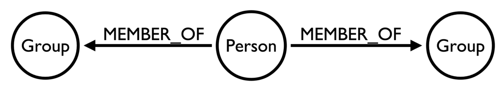

Members and Groups
========================================================

Now we want to find out how the members of different groups overlap.

```{r message=FALSE}
library(RNeo4j)
library(dplyr)
library(ggplot2)
```

```{r}
graph = startGraph("http://localhost:7474/db/data/")
options(width = 200)
```

This time we're only interested in a very specific part of the graph:



In the following query we take every pair of groups and calculate how many common members they have:

```{r}
query = "CYPHER 2.2-rule MATCH (group1:Group), (group2:Group)
         WHERE group1 <> group2
         OPTIONAL MATCH p = (group1)<-[:MEMBER_OF]-()-[:MEMBER_OF]->(group2)
         WITH group1, group2, COLLECT(p) AS paths
         RETURN group1.name, group2.name, LENGTH(paths) as commonMembers
         ORDER BY group1.name, group2.name"

group_overlap = cypher(graph, query)

pickRandomRows = function(df, numberOfRows = 10) {
  df %>% slice(as.integer(runif(numberOfRows,0, length(df[,1]))))
}

pickRandomRows(group_overlap, 10)
```

```{r fig.width=23, fig.height=15, warning = FALSE, message = FALSE}
ggplot(group_overlap, aes(x=group1.name, y=group2.name, fill=commonMembers)) + 
  geom_bin2d() +
  geom_text(aes(label = commonMembers)) +
  labs(x= "Group", y="Group", title="Member Group Member Overlap") +
  scale_fill_gradient(low="white", high="red") +
  theme(axis.text = element_text(size = 12, color = "black"),
        axis.title = element_text(size = 14, color = "black"),
        plot.title = element_text(size = 16, color = "black"),
        axis.text.x = element_text(angle = 45, vjust = 1, hjust = 1))
```

That shows absolute values but what's more interesting is what % of a groups members are members of other groups. We could then learn more about potential joint meetups or topics that the group may find interesting.


```{r}
query = "CYPHER 2.2-rule MATCH (group1:Group), (group2:Group)
WHERE group1 <> group2
OPTIONAL MATCH (group1)<-[:MEMBER_OF]-(member)

WITH group1, group2, COLLECT(member) AS group1Members
WITH group1, group2, group1Members, LENGTH(group1Members) AS numberOfGroup1Members

UNWIND group1Members AS member
OPTIONAL MATCH path =  (member)-[:MEMBER_OF]->(group2) 
WITH group1, group2, COLLECT(path) AS paths, numberOfGroup1Members
WITH group1, group2, LENGTH(paths) as commonMembers, numberOfGroup1Members

RETURN group1.name, group2.name, toInt(round(100.0 * commonMembers / numberOfGroup1Members)) AS percentage
ORDER BY  group1.name, group1.name"

group_overlap_percentage = cypher(graph, query)
pickRandomRows(group_overlap_percentage)
```

```{r fig.width=23, fig.height=15, warning = FALSE, message = FALSE}
ggplot(group_overlap_percentage, aes(x=group2.name, y=group1.name, fill=percentage)) + 
  geom_bin2d() +
  geom_text(aes(label = percentage)) +
  labs(x= "Group", y="Group", title="Member Group Member Overlap") +
  scale_fill_gradient(low="white", high="red") +
  theme(axis.text = element_text(size = 12, color = "black"),
        axis.title = element_text(size = 14, color = "black"),
        plot.title = element_text(size = 16, color = "black"),
        axis.text.x = element_text(angle = 45, vjust = 1, hjust = 1))
```

## How many groups are people members of?

```{r}
query = "match (p:MeetupProfile)-[:MEMBER_OF]->()
         return ID(p), COUNT(*) AS groups
         ORDER BY groups DESC"

group_count = cypher(graph, query)
pickRandomRows(group_count)
```

```{r fig.width=15, fig.height=10}
ggplot(aes(x = groups, y = n), data = group_count %>% count(groups)) + 
  geom_bar(stat="identity", fill="dark blue") + 
  scale_y_sqrt() +
  scale_x_continuous(breaks = round(seq(min(group_count$groups), max(group_count$groups), by = 1),1)) +
  ggtitle("Number of groups people are members of")
```

It's a typical long tail curve where there's a few people who are interested in lots of different topics but most people are only interested in 1 or 2 things.

We might then look at how many groups people belong to grouped by meetup group:

```{r}
query = "CYPHER 2.2-rule MATCH (group:Group)
         MATCH (group)<-[:MEMBER_OF]-(member)
         WITH group, COLLECT(member) AS members
         UNWIND members AS member
         OPTIONAL MATCH (member)-[:MEMBER_OF]->(other)
         WITH group, member, COLLECT(other) AS otherGroups
         WITH group, member, LENGTH(otherGroups) AS numberOfOtherGroups
         RETURN group.name, numberOfOtherGroups, COUNT(*) AS numberOfPeople
         ORDER BY group.name, numberOfOtherGroups "
members_of_other_groups = cypher(graph, query)

summariseNumberOfMembers = function(numberOfGroups) {
  mapply(function(number) {
    if(number == 1) {
       "1";
    } else if(number >1 && number <= 5) {
       "Up to 5";
    } else if(number > 5 && number <= 10) {
       "Up to 10";
    } else {
      "More than 10";
    }
  }, numberOfGroups) 
}

members_of_other_groups$summarisedNumberOfOtherGroups = factor(summariseNumberOfMembers(members_of_other_groups$numberOfOtherGroups), 
                                                               levels = c("1", "Up to 5", "Up to 10", "More than 10"))

pickRandomRows(members_of_other_groups)
```

```{r fig.width=15, fig.height=10}
ggplot(data=members_of_other_groups, 
       aes(x = group.name, 
           y = numberOfPeople, 
           fill=members_of_other_groups$summarisedNumberOfOtherGroups)) + 
  geom_bar(stat="identity") +
  coord_flip() +  
  ylab("") + 
  xlab("") +
  guides(fill=guide_legend(title="Number of Groups")) +
   scale_fill_manual(values = c("#B2DFEE", "#88ACE0", "#36648B", "#380474" )) 
```