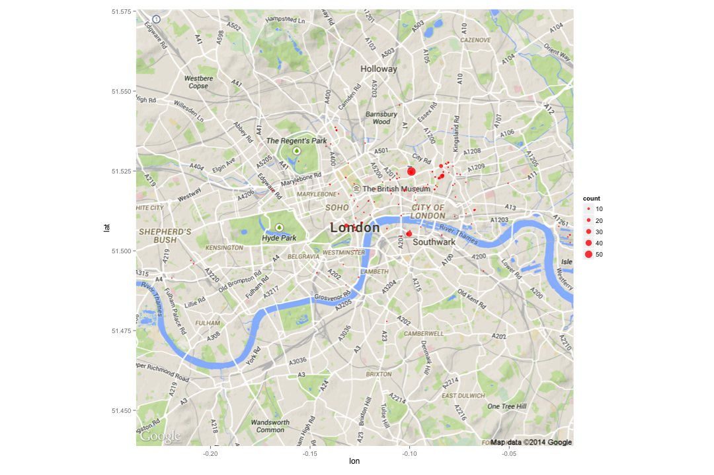
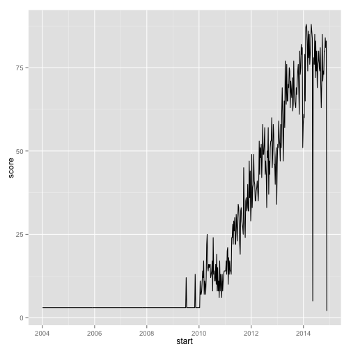

Members and Groups
========================================================

Now we want to find out how the members of different groups overlap.


```r
library(RNeo4j)
library(dplyr)
library(ggplot2)
```


```r
graph = startGraph("http://localhost:7474/db/data/")
options(width = 200)
```


```r
query = "CYPHER 2.2-rule MATCH (group1:Group), (group2:Group)
         WHERE group1 <> group2
         OPTIONAL MATCH p = (group1)<-[:MEMBER_OF]-()-[:MEMBER_OF]->(group2)
         WITH group1, group2, COLLECT(p) AS paths
         RETURN group1.name, group2.name, LENGTH(paths) as commonMembers
         ORDER BY group1.name, group2.name"

group_overlap = cypher(graph, query)

pickRandomRows = function(df, numberOfRows = 10) {
  df %>% slice(as.integer(runif(numberOfRows,0, length(df[,1]))))
}

pickRandomRows(group_overlap, 10)
```

```
##                                         group1.name                                               group2.name commonMembers
## 1                   Enterprise Search London Meetup                                  Scale Warriors of London             3
## 2                                   Big Data London                                              Redis London            81
## 3                                       Hive London                                          Couchbase London            25
## 4  TokuMX London - Super-charging MongoDB in London                      Equal Experts Technical Meetup Group             1
## 5                                London Riak Meetup                                             Women in Data             6
## 6                          OpenCredo Tech Workshops                                              London NoSQL             2
## 7                         Neo4j - London User Group                                           GridGain London             4
## 8                Hazelcast User Group London (HUGL)                  Span: scalable and distributed computing             5
## 9                   London ElasticSearch User Group                                     Hadoop Users Group UK           152
## 10                   London PostgreSQL Meetup Group London Actionable Behavioral Analytics for Web and Mobile             2
```


```r
ggplot(group_overlap, aes(x=group1.name, y=group2.name, fill=commonMembers)) + 
  geom_bin2d() +
  geom_text(aes(label = commonMembers)) +
  labs(x= "Group", y="Group", title="Member Group Member Overlap") +
  scale_fill_gradient(low="white", high="red") +
  theme(axis.text = element_text(size = 12, color = "black"),
        axis.title = element_text(size = 14, color = "black"),
        plot.title = element_text(size = 16, color = "black"),
        axis.text.x = element_text(angle = 45, vjust = 1, hjust = 1))
```

 

That shows absolute values but what's more interesting is what % of a groups members are members of other groups. We could then learn more about potential joint meetups or topics that the group may find interesting.


```r
query = "CYPHER 2.2-rule MATCH (group1:Group), (group2:Group)
WHERE group1 <> group2
OPTIONAL MATCH (group1)<-[:MEMBER_OF]-(member)

WITH group1, group2, COLLECT(member) AS group1Members
WITH group1, group2, group1Members, LENGTH(group1Members) AS numberOfGroup1Members

UNWIND group1Members AS member
OPTIONAL MATCH path =  (member)-[:MEMBER_OF]->(group2) 
WITH group1, group2, COLLECT(path) AS paths, numberOfGroup1Members
WITH group1, group2, LENGTH(paths) as commonMembers, numberOfGroup1Members

RETURN group1.name, group2.name, toInt(round(100.0 * commonMembers / numberOfGroup1Members)) AS percentage
ORDER BY  group1.name, group1.name"

group_overlap_percentage = cypher(graph, query)
pickRandomRows(group_overlap_percentage)
```

```
##                                           group1.name                                               group2.name percentage
## 1                Equal Experts Technical Meetup Group                            London PostgreSQL Meetup Group          2
## 2  The London Distributed Graph Database Meetup Group                                 Neo4j - London User Group         54
## 3    TokuMX London - Super-charging MongoDB in London                                               Hive London          0
## 4       Big Data / Data Science / Data Analytics Jobs London Actionable Behavioral Analytics for Web and Mobile          2
## 5                      London Cloud Computing / NoSQL                                   Big Data Jobs in London          6
## 6                     Enterprise Search London Meetup                    Marklogic Financial Services Community          0
## 7                           London MongoDB User Group             Big Data / Data Science / Data Analytics Jobs          1
## 8                      London PostgreSQL Meetup Group                                 Neo4j - London User Group         19
## 9                                        Redis London London Actionable Behavioral Analytics for Web and Mobile          1
## 10                    Enterprise Search London Meetup        The London Distributed Graph Database Meetup Group          2
```


```r
ggplot(group_overlap_percentage, aes(x=group2.name, y=group1.name, fill=percentage)) + 
  geom_bin2d() +
  geom_text(aes(label = percentage)) +
  labs(x= "Group", y="Group", title="Member Group Member Overlap") +
  scale_fill_gradient(low="white", high="red") +
  theme(axis.text = element_text(size = 12, color = "black"),
        axis.title = element_text(size = 14, color = "black"),
        plot.title = element_text(size = 16, color = "black"),
        axis.text.x = element_text(angle = 45, vjust = 1, hjust = 1))
```

 


```r
query = "match (p:MeetupProfile)-[:MEMBER_OF]->()
         return ID(p), COUNT(*) AS groups
         ORDER BY groups DESC"

group_count = cypher(graph, query)
pickRandomRows(group_count)
```

```
##    ID(p) groups
## 1  29147      1
## 2  32364      1
## 3  42076      1
## 4  37682      3
## 5  16651      1
## 6  21731      3
## 7  48100      1
## 8  53938      1
## 9  11963      1
## 10  1591      1
```


```r
ggplot(aes(x = groups, y = n), data = group_count %>% count(groups)) + 
  geom_bar(stat="identity", fill="dark blue") + 
  scale_y_sqrt() +
  scale_x_continuous(breaks = round(seq(min(group_count$groups), max(group_count$groups), by = 1),1)) +
  ggtitle("Number of groups people are members of")
```

 


```r
query = "CYPHER 2.2-rule MATCH (group:Group)
         MATCH (group)<-[:MEMBER_OF]-(member)
         WITH group, COLLECT(member) AS members
         UNWIND members AS member
         OPTIONAL MATCH (member)-[:MEMBER_OF]->(other)
         WITH group, member, COLLECT(other) AS otherGroups
         WITH group, member, LENGTH(otherGroups) AS numberOfOtherGroups
         RETURN group.name, numberOfOtherGroups, COUNT(*) AS numberOfPeople
         ORDER BY group.name, numberOfOtherGroups "
members_of_other_groups = cypher(graph, query)

summariseNumberOfMembers = function(numberOfGroups) {
  mapply(function(number) {
    if(number == 1) {
       "1";
    } else if(number >1 && number <= 5) {
       "Up to 5";
    } else if(number > 5 && number <= 10) {
       "Up to 10";
    } else {
      "More than 10";
    }
  }, numberOfGroups) 
}

members_of_other_groups$summarisedNumberOfOtherGroups = factor(summariseNumberOfMembers(members_of_other_groups$numberOfOtherGroups), 
                                                               levels = c("1", "Up to 5", "Up to 10", "More than 10"))

pickRandomRows(members_of_other_groups)
```

```
##                        group.name numberOfOtherGroups numberOfPeople summarisedNumberOfOtherGroups
## 1                Couchbase London                   4             25                       Up to 5
## 2         Data Enthusiasts London                  13              5                  More than 10
## 3                 Big Data London                  11             19                  More than 10
## 4                Cassandra London                   4            121                       Up to 5
## 5   Big Data Developers in London                  14              2                  More than 10
## 6              London Riak Meetup                  15              4                  More than 10
## 7     Big Data Week London Meetup                   3             14                       Up to 5
## 8  London Cloud Computing / NoSQL                  20              1                  More than 10
## 9                Couchbase London                  17              1                  More than 10
## 10            HBase London Meetup                  13              3                  More than 10
```


```r
ggplot(data=members_of_other_groups, 
       aes(x = group.name, 
           y = numberOfPeople, 
           fill=members_of_other_groups$summarisedNumberOfOtherGroups)) + 
  geom_bar(stat="identity") +
  coord_flip() +  ylab("") + xlab("") +
  guides(fill=guide_legend(title="Number of Groups"))
```

 
