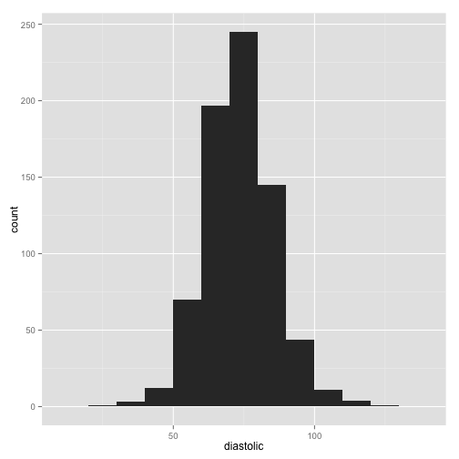

```r
library(faraway)
library(dplyr)
library(ggplot2)

data(pima)
```


```r
pima %>% head()
```

```
##   pregnant glucose diastolic triceps insulin  bmi diabetes age test
## 1        6     148        72      35       0 33.6    0.627  50    1
## 2        1      85        66      29       0 26.6    0.351  31    0
## 3        8     183        64       0       0 23.3    0.672  32    1
## 4        1      89        66      23      94 28.1    0.167  21    0
## 5        0     137        40      35     168 43.1    2.288  33    1
## 6        5     116        74       0       0 25.6    0.201  30    0
```

```r
summary(pima)
```

```
##     pregnant         glucose        diastolic         triceps     
##  Min.   : 0.000   Min.   :  0.0   Min.   :  0.00   Min.   : 0.00  
##  1st Qu.: 1.000   1st Qu.: 99.0   1st Qu.: 62.00   1st Qu.: 0.00  
##  Median : 3.000   Median :117.0   Median : 72.00   Median :23.00  
##  Mean   : 3.845   Mean   :120.9   Mean   : 69.11   Mean   :20.54  
##  3rd Qu.: 6.000   3rd Qu.:140.2   3rd Qu.: 80.00   3rd Qu.:32.00  
##  Max.   :17.000   Max.   :199.0   Max.   :122.00   Max.   :99.00  
##     insulin           bmi           diabetes           age       
##  Min.   :  0.0   Min.   : 0.00   Min.   :0.0780   Min.   :21.00  
##  1st Qu.:  0.0   1st Qu.:27.30   1st Qu.:0.2437   1st Qu.:24.00  
##  Median : 30.5   Median :32.00   Median :0.3725   Median :29.00  
##  Mean   : 79.8   Mean   :31.99   Mean   :0.4719   Mean   :33.24  
##  3rd Qu.:127.2   3rd Qu.:36.60   3rd Qu.:0.6262   3rd Qu.:41.00  
##  Max.   :846.0   Max.   :67.10   Max.   :2.4200   Max.   :81.00  
##       test      
##  Min.   :0.000  
##  1st Qu.:0.000  
##  Median :0.000  
##  Mean   :0.349  
##  3rd Qu.:1.000  
##  Max.   :1.000
```

```r
sort(pima$diastolic)
```

```
##   [1]   0   0   0   0   0   0   0   0   0   0   0   0   0   0   0   0   0
##  [18]   0   0   0   0   0   0   0   0   0   0   0   0   0   0   0   0   0
##  [35]   0  24  30  30  38  40  44  44  44  44  46  46  48  48  48  48  48
##  [52]  50  50  50  50  50  50  50  50  50  50  50  50  50  52  52  52  52
##  [69]  52  52  52  52  52  52  52  54  54  54  54  54  54  54  54  54  54
##  [86]  54  55  55  56  56  56  56  56  56  56  56  56  56  56  56  58  58
## [103]  58  58  58  58  58  58  58  58  58  58  58  58  58  58  58  58  58
## [120]  58  58  60  60  60  60  60  60  60  60  60  60  60  60  60  60  60
## [137]  60  60  60  60  60  60  60  60  60  60  60  60  60  60  60  60  60
## [154]  60  60  60  60  60  61  62  62  62  62  62  62  62  62  62  62  62
## [171]  62  62  62  62  62  62  62  62  62  62  62  62  62  62  62  62  62
## [188]  62  62  62  62  62  62  64  64  64  64  64  64  64  64  64  64  64
## [205]  64  64  64  64  64  64  64  64  64  64  64  64  64  64  64  64  64
## [222]  64  64  64  64  64  64  64  64  64  64  64  64  64  64  64  65  65
## [239]  65  65  65  65  65  66  66  66  66  66  66  66  66  66  66  66  66
## [256]  66  66  66  66  66  66  66  66  66  66  66  66  66  66  66  66  66
## [273]  66  68  68  68  68  68  68  68  68  68  68  68  68  68  68  68  68
## [290]  68  68  68  68  68  68  68  68  68  68  68  68  68  68  68  68  68
## [307]  68  68  68  68  68  68  68  68  68  68  68  68  70  70  70  70  70
## [324]  70  70  70  70  70  70  70  70  70  70  70  70  70  70  70  70  70
## [341]  70  70  70  70  70  70  70  70  70  70  70  70  70  70  70  70  70
## [358]  70  70  70  70  70  70  70  70  70  70  70  70  70  70  70  70  70
## [375]  70  72  72  72  72  72  72  72  72  72  72  72  72  72  72  72  72
## [392]  72  72  72  72  72  72  72  72  72  72  72  72  72  72  72  72  72
## [409]  72  72  72  72  72  72  72  72  72  72  72  74  74  74  74  74  74
## [426]  74  74  74  74  74  74  74  74  74  74  74  74  74  74  74  74  74
## [443]  74  74  74  74  74  74  74  74  74  74  74  74  74  74  74  74  74
## [460]  74  74  74  74  74  74  74  74  74  74  74  74  75  75  75  75  75
## [477]  75  75  75  76  76  76  76  76  76  76  76  76  76  76  76  76  76
## [494]  76  76  76  76  76  76  76  76  76  76  76  76  76  76  76  76  76
## [511]  76  76  76  76  76  76  76  76  78  78  78  78  78  78  78  78  78
## [528]  78  78  78  78  78  78  78  78  78  78  78  78  78  78  78  78  78
## [545]  78  78  78  78  78  78  78  78  78  78  78  78  78  78  78  78  78
## [562]  78  78  80  80  80  80  80  80  80  80  80  80  80  80  80  80  80
## [579]  80  80  80  80  80  80  80  80  80  80  80  80  80  80  80  80  80
## [596]  80  80  80  80  80  80  80  80  82  82  82  82  82  82  82  82  82
## [613]  82  82  82  82  82  82  82  82  82  82  82  82  82  82  82  82  82
## [630]  82  82  82  82  84  84  84  84  84  84  84  84  84  84  84  84  84
## [647]  84  84  84  84  84  84  84  84  84  84  85  85  85  85  85  85  86
## [664]  86  86  86  86  86  86  86  86  86  86  86  86  86  86  86  86  86
## [681]  86  86  86  88  88  88  88  88  88  88  88  88  88  88  88  88  88
## [698]  88  88  88  88  88  88  88  88  88  88  88  90  90  90  90  90  90
## [715]  90  90  90  90  90  90  90  90  90  90  90  90  90  90  90  90  92
## [732]  92  92  92  92  92  92  92  94  94  94  94  94  94  95  96  96  96
## [749]  96  98  98  98 100 100 100 102 104 104 106 106 106 108 108 110 110
## [766] 110 114 122
```


```r
pima$diastolic[pima$diastolic == 0] <- NA 
pima$glucose[pima$glucose == 0] <- NA
pima$triceps[pima$triceps == 0] <- NA
pima$insulin[pima$insulin == 0] <- NA
pima$bmi[pima$bmi == 0] <- NA
```


```r
pima$test <- factor(pima$test)
summary(pima$test)
```

```
##   0   1 
## 500 268
```


```r
levels(pima$test) <- c("negative","positive")
summary(pima)
```

```
##     pregnant         glucose        diastolic         triceps     
##  Min.   : 0.000   Min.   : 44.0   Min.   : 24.00   Min.   : 7.00  
##  1st Qu.: 1.000   1st Qu.: 99.0   1st Qu.: 64.00   1st Qu.:22.00  
##  Median : 3.000   Median :117.0   Median : 72.00   Median :29.00  
##  Mean   : 3.845   Mean   :121.7   Mean   : 72.41   Mean   :29.15  
##  3rd Qu.: 6.000   3rd Qu.:141.0   3rd Qu.: 80.00   3rd Qu.:36.00  
##  Max.   :17.000   Max.   :199.0   Max.   :122.00   Max.   :99.00  
##                   NA's   :5       NA's   :35       NA's   :227    
##     insulin            bmi           diabetes           age       
##  Min.   : 14.00   Min.   :18.20   Min.   :0.0780   Min.   :21.00  
##  1st Qu.: 76.25   1st Qu.:27.50   1st Qu.:0.2437   1st Qu.:24.00  
##  Median :125.00   Median :32.30   Median :0.3725   Median :29.00  
##  Mean   :155.55   Mean   :32.46   Mean   :0.4719   Mean   :33.24  
##  3rd Qu.:190.00   3rd Qu.:36.60   3rd Qu.:0.6262   3rd Qu.:41.00  
##  Max.   :846.00   Max.   :67.10   Max.   :2.4200   Max.   :81.00  
##  NA's   :374      NA's   :11                                      
##        test    
##  negative:500  
##  positive:268  
##                
##                
##                
##                
## 
```


```r
hist(pima$diastolic)
```

 

```r
ggplot(aes(x = diastolic), data = pima) + geom_histogram(binwidth = 10 )
```

 
