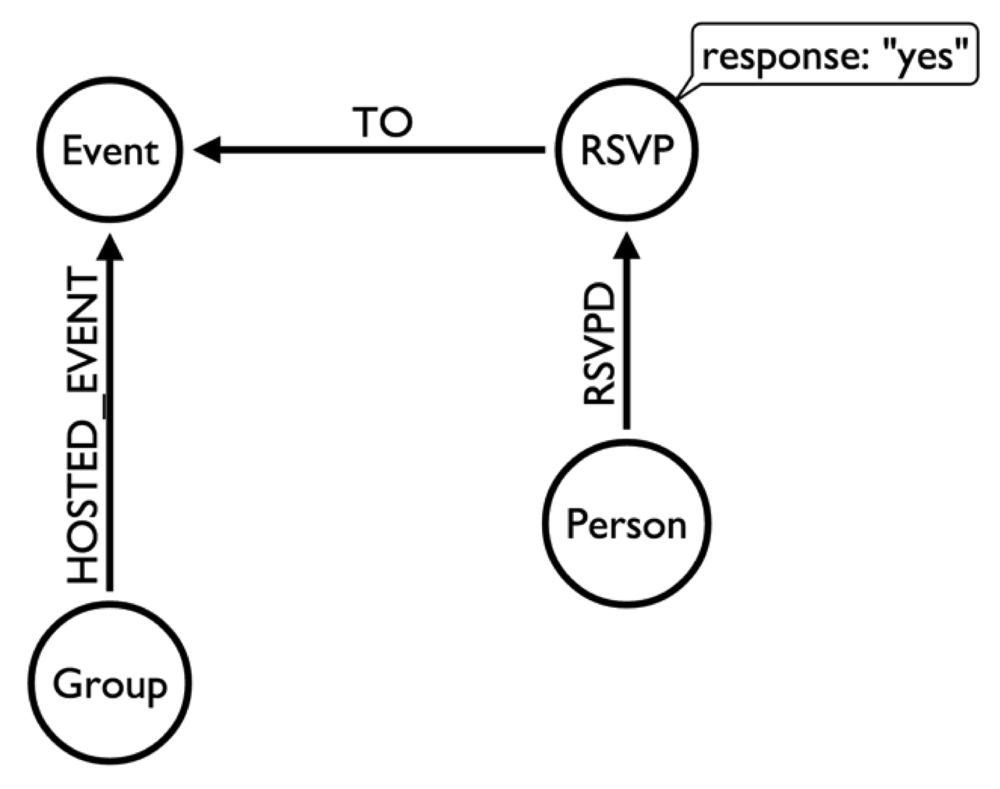
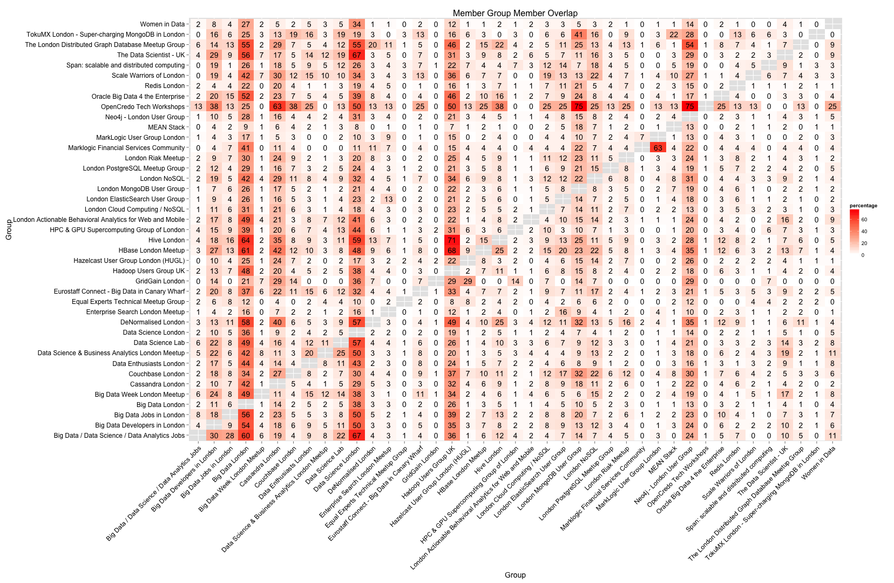
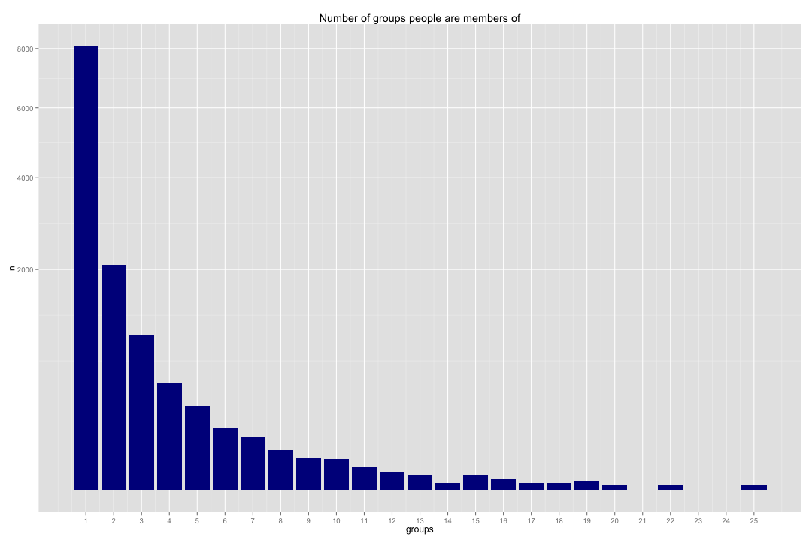

When do people go to meetups?
========================================================

The first thing we'll explore is when people go to meetups by day of week and month of year - starting simple!

Let's import the libraries we'll need:


```r
library(RNeo4j)
library(dplyr)
library(ggplot2)
library(gridExtra)
```

And setup our connection to Neo4j and define a function which we'll use to translate the timestamps we get from Neo4j into R Dates:


```r
timestampToDate <- function(x) as.POSIXct(x / 1000, origin="1970-01-01", tz = "GMT")
graph = startGraph("http://localhost:7474/db/data/")
options(width = 200)
```

This is the part of the graph that we're interested in:



Now we'll execute a query to get back the names of events, the date they were hosted and the number of people who RSVP'd 'yes' which we'll be using as a proxy for 'attended':


```r
query = "MATCH (g:Group)-[:HOSTED_EVENT]->(event)<-[:TO]-({response: 'yes'})<-[:RSVPD]-()
         WHERE (event.time + event.utc_offset) < timestamp()
         RETURN g.name, 
                event.time + event.utc_offset AS eventTime,
                event.name, 
                COUNT(*) AS rsvps"

events = cypher(graph, query)

events$eventTime <- timestampToDate(events$eventTime)
events$day <- factor(format(events$eventTime, "%A"), levels = c("Sunday", "Monday", "Tuesday", "Wednesday", "Thursday", "Friday", "Saturday"))
events$month <- factor(format(events$eventTime, "%B"), levels = month.name)

pickRandomRows = function(df, numberOfRows = 10) {
  df %>% slice(as.integer(runif(numberOfRows,0, length(df[,1]))))
}
```

Let's have a look at the most attended events to get a feel for the data:


```r
events %>% select(event.name, g.name, rsvps) %>% arrange(desc(rsvps)) %>% pickRandomRows()
```

```
##                                                  event.name                           g.name rsvps
## 1                     Retail Goes Mobile: iBeacons - London   London Cloud Computing / NoSQL    16
## 2              Ian Robinson and Jim Webber's Neo4j Tutorial        Neo4j - London User Group     1
## 3                           Enterprise Search EUROPE Meetup  Enterprise Search London Meetup    25
## 4                  London MongoDB User Group 2012 Meetup #3        London MongoDB User Group    49
## 5                                  Talking Clouds and Grids   London Cloud Computing / NoSQL     3
## 6  Winter Big Data 4 Enterprise Meetup with Beer and Snacks Oracle Big Data 4 the Enterprise    54
## 7                                 Midweek MEAN Stack meetup                       MEAN Stack    52
## 8                   Introduction to Graph Database Modeling        Neo4j - London User Group    23
## 9               Real-time Analytics using Indexed MapReduce         Scale Warriors of London    22
## 10    HBase User Group London: Types in HBase & Apache Gora              HBase London Meetup    33
```

Now we'll get back to checking which day of the week people go to meetups on:


```r
byDay = events %>% 
  group_by(day) %>%
  summarise(events = n(), 
            count = sum(rsvps)) %>%
  mutate(ave = count / events) %>%
  arrange(day)
byDay
```

```
## Source: local data frame [6 x 4]
## 
##         day events count      ave
## 1    Monday     63  4065 64.52381
## 2   Tuesday    145  6431 44.35172
## 3 Wednesday    217  8914 41.07834
## 4  Thursday    103  5423 52.65049
## 5    Friday     11   382 34.72727
## 6  Saturday      9   638 70.88889
```

We first group by day and then use the `summarise` function which allows us to calculate the number of events on that day and then sum up the RSVPs as well. We then use the `mutate` function to add an average column before sorting the data frame by day.

ggplot gives us a nice way of visualising this data:


```r
g1 = ggplot(aes(x = day, y = ave), data = byDay) + 
  geom_bar(stat="identity", fill="dark blue") + 
  ggtitle("Average attendees by day")

g2 = ggplot(aes(x = day, y = count), data = byDay) + 
  geom_bar(stat="identity", fill="dark blue") + 
  ggtitle("Total attendees by day")

grid.arrange(g1,g2, ncol = 1)
```

 

We can do the same thing to see which months of the year are most popular for meetups:


```r
byMonth = events %>% 
  group_by(month) %>%
  summarise(events = n(), 
            count = sum(rsvps)) %>%
  mutate(ave = count / events) %>%
  arrange(desc(ave))
```


```r
g3 = ggplot(aes(x = month, y = ave), data = byMonth) + 
  geom_bar(stat="identity", fill="dark blue") + 
  ggtitle("Average attendees by month")

g4 = ggplot(aes(x = month, y = count), data = byMonth) + 
  geom_bar(stat="identity", fill="dark blue") + 
  ggtitle("Total attendees by month")

grid.arrange(g3,g4, ncol = 1)
```

 

