## Explore relationship between date/time and RSVPs


```r
library(RNeo4j)
library(dplyr)
library(ggplot2)
library(partykit)
library(lubridate)

graph = startGraph("http://localhost:7574/db/data/")
timestampToDate = function(x) as.POSIXct(x / 1000, origin="1970-01-01", tz = "GMT")
```

### Load up all the data


```r
# london nosql events
query = "MATCH (g:Group)-[:HOSTED_EVENT]->(event)<-[:TO]-({response: 'yes'})<-[:RSVPD]-(),
               (event)-[:HELD_AT]->(venue)
         WHERE (event.time + event.utc_offset) < timestamp()
         RETURN g.name, 
                event.time + event.utc_offset AS eventTime,
                event.name, 
                COUNT(*) AS rsvps"

events = cypher(graph, query)
events$eventTime <- timestampToDate(events$eventTime)
events = events %>%  select(- c(g.name,event.name))
events %>% select(eventTime, rsvps) %>% head()
```

```
##             eventTime rsvps
## 1 2011-11-30 17:00:00     8
## 2 2013-07-12 09:00:00    12
## 3 2014-01-15 18:30:00    35
## 4 2013-07-25 18:15:00    35
## 5 2013-11-07 17:30:00     2
## 6 2011-10-12 17:30:00     2
```

### Hour of day vs RSVPs


```r
events$hour = as.numeric(format(events$eventTime, "%H"))
events %>% select(hour, rsvps) %>% head()
```

```
##   hour rsvps
## 1   17     8
## 2    9    12
## 3   18    35
## 4   18    35
## 5   17     2
## 6   17     2
```


```r
ggplot(aes(x = hour, y = rsvps), data = events) + geom_point()
```

 

```r
timeModel = lm(rsvps ~ hour, events)
ggplot(aes(x = hour, y = rsvps), data = events) + 
  geom_point() +   
  geom_abline(intercept = timeModel$coef[1], slope = timeModel$coef[2])
```

 

```r
events$timeModelPred = predict(timeModel, events)
events$timeModelPredResiduals = events$timeModelPred - events$rsvps

cor(events$timeModelPred, events$rsvps)
```

```
## [1] 0.1806145
```

```r
ggplot(aes(x = timeModelPred, y = timeModelPredResiduals), data = events) + 
  geom_point()  
```

 

### Get rid of that outlier event that happened at midnight!


```r
events = events %>% filter(hour > 0)
  
ggplot(aes(x = hour, y = rsvps), data = events) + geom_point()
```

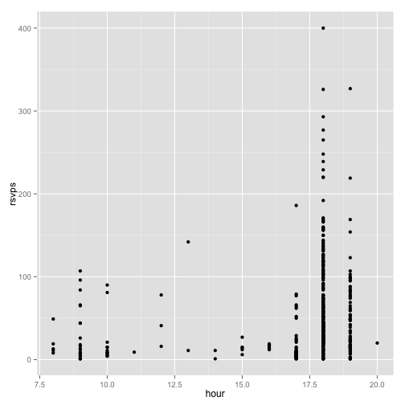 

```r
timeModel = lm(rsvps ~ hour, events)
ggplot(aes(x = hour, y = rsvps), data = events) + 
  geom_point() +   
  geom_abline(intercept = timeModel$coef[1], slope = timeModel$coef[2])
```

 

```r
events$timeModelPred = predict(timeModel, events)
events$timeModelPredResiduals = events$timeModelPred - events$rsvps

cor(events$timeModelPred, events$rsvps)
```

```
## [1] 0.1775115
```

```r
ggplot(aes(x = timeModelPred, y = timeModelPredResiduals), data = events) + 
  geom_point()  
```

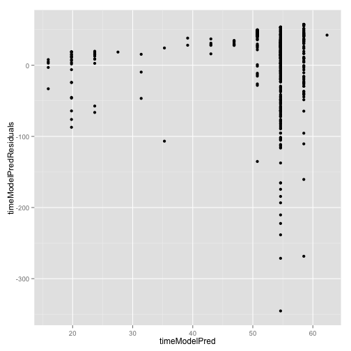 

### log version of hour of day vs RSVPs


```r
events = events %>% mutate(logHour  = log(hour), logRSVPs = log(rsvps))

ggplot(aes(x = logHour, y = logRSVPs), data = events) + geom_point() 
```

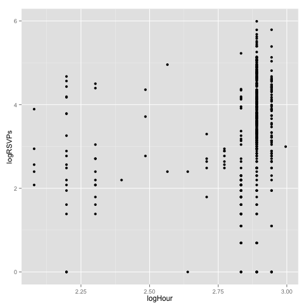 

```r
logTimeModel = lm(logRSVPs ~ logHour, events)
ggplot(aes(x = logHour, y = logRSVPs), data = events) + 
  geom_point() +   
  geom_abline(intercept = logTimeModel$coef[1], slope = logTimeModel$coef[2])
```

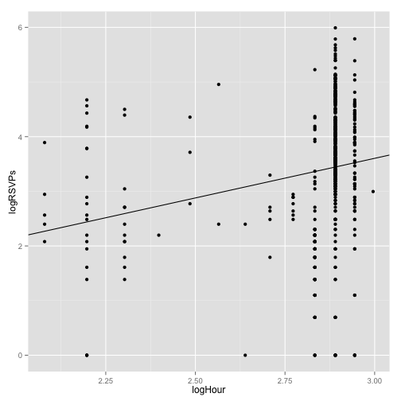 

```r
events$logTimeModelPred = predict(logTimeModel, events)
events$logTimeModelPredResiduals = events$logTimeModelPred - events$logRSVPs

cor(events$logTimeModelPred , events$logRSVPs)
```

```
## [1] 0.2221453
```

```r
ggplot(aes(x = logTimeModelPred, y = logTimeModelPredResiduals), data = events) + 
  geom_point()
```

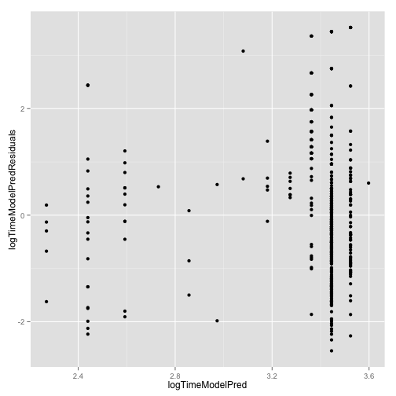 

### Hours into the day as fraction vs RSVPs


```r
events$hoursIntoDay = as.numeric(events$eventTime - trunc(events$eventTime, "day"), units="hours")
events %>% select(hoursIntoDay, rsvps) %>% head()
```

```
##   hoursIntoDay rsvps
## 1        17.00     8
## 2         9.00    12
## 3        18.50    35
## 4        18.25    35
## 5        17.50     2
## 6        17.50     2
```

### log version of hours into day vs RSVPs


```r
events = events %>% mutate(logHoursIntoDay  = log(hoursIntoDay), logRSVPs = log(rsvps))

ggplot(aes(x = logHoursIntoDay, y = logRSVPs), data = events) + geom_point() 
```

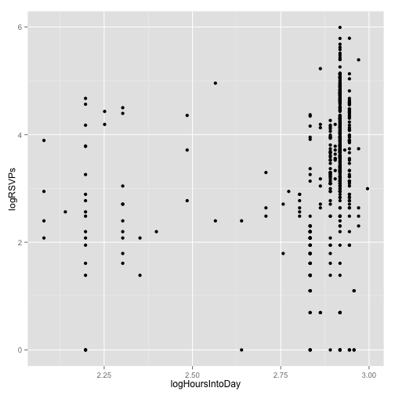 

```r
logHoursIntoDayModel = lm(logRSVPs ~ logHoursIntoDay, events)
ggplot(aes(x = logHoursIntoDay, y = logRSVPs), data = events) + 
  geom_point() +   
  geom_abline(intercept = logHoursIntoDayModel$coef[1], slope = logHoursIntoDayModel$coef[2])
```

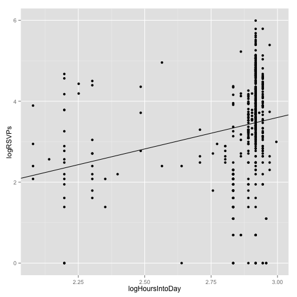 

```r
events$logHoursIntoDayModelPred = predict(logHoursIntoDayModel, events)
events$logHoursIntoDayModelPredResiduals = events$logHoursIntoDayModelPred - events$logRSVPs

cor(events$logHoursIntoDayModelPred, events$logRSVPs)
```

```
## [1] 0.2417261
```

```r
ggplot(aes(x = logHoursIntoDayModelPred , y = logHoursIntoDayModelPredResiduals), data = events) + 
  geom_point()
```

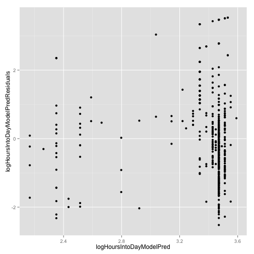 

### Distance from the weekend in hours


```r
distanceFromWeekend = function(datesToLookup) {
  mapply(function(dateToLookup) {
    before = floor_date(dateToLookup, "week") + hours(23) + minutes(59) + seconds(59)
    after  = ceiling_date(dateToLookup, "week") - days(1)
    timeToBefore = dateToLookup - before
    timeToAfter = after - dateToLookup
    
    if(timeToBefore < 0 || timeToAfter < 0) {
      0  
    } else {
      if(timeToBefore < timeToAfter) {
        timeToBefore / dhours(1)
      } else {
        timeToAfter / dhours(1)
      }
    }  
  }, datesToLookup)
}

events = events %>% mutate(fromWeekend = distanceFromWeekend(eventTime))
events %>% select(fromWeekend, rsvps) %>% head()
```

```
##   fromWeekend rsvps
## 1       55.00     8
## 2       15.00    12
## 3       53.50    35
## 4       29.75    35
## 5       30.50     2
## 6       54.50     2
```


```r
ggplot(aes(x = fromWeekend, y = rsvps), data = events) + geom_point()
```

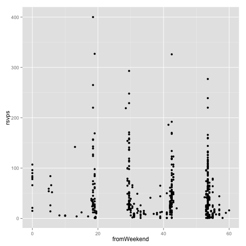 

### log version


```r
events = events %>% mutate(logFromWeekend  = ifelse(fromWeekend == 0, 0, log(fromWeekend)))

ggplot(aes(x = logFromWeekend, y = logRSVPs), data = events) + geom_point() 
```

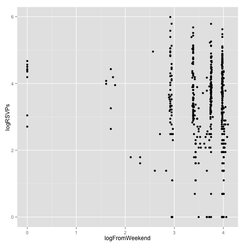 

```r
logFromWeekendModel = lm(logRSVPs ~ logFromWeekend, events)
ggplot(aes(x = logFromWeekend, y = logRSVPs), data = events) + 
  geom_point() +   
  geom_abline(intercept = logFromWeekendModel$coef[1], slope = logFromWeekendModel$coef[2])
```

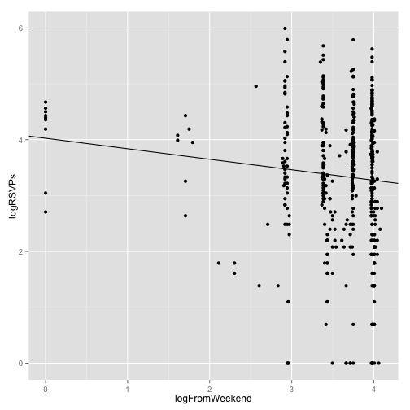 

```r
events$logFromWeekendModelPred = predict(logFromWeekendModel, events)
events$logFromWeekendModelPredResiduals = events$logFromWeekendModelPred - events$logRSVPs

cor(events$logFromWeekendModelPred, events$logRSVPs)
```

```
## [1] 0.1006561
```

```r
ggplot(aes(x = logFromWeekendModelPred , y = logFromWeekendModelPredResiduals), data = events) + 
  geom_point()
```

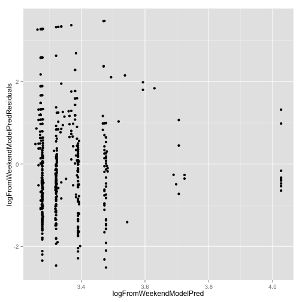 

### excluding weekends


```r
events = events %>% filter(fromWeekend > 0) %>% mutate(logFromWeekend  = log(fromWeekend))

ggplot(aes(x = logFromWeekend, y = logRSVPs), data = events) + geom_point() 
```

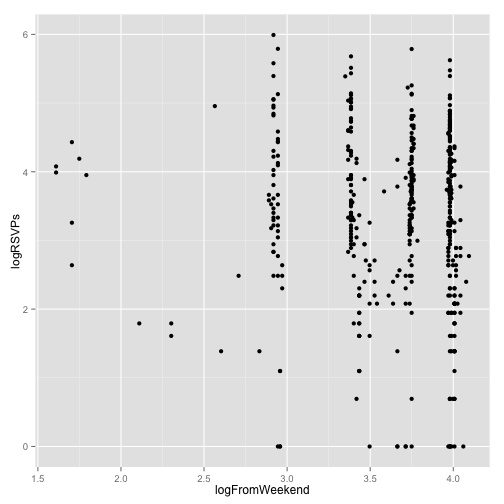 

```r
logFromWeekendModel = lm(logRSVPs ~ logFromWeekend, events)
ggplot(aes(x = logFromWeekend, y = logRSVPs), data = events) + 
  geom_point() +   
  geom_abline(intercept = logFromWeekendModel$coef[1], slope = logFromWeekendModel$coef[2])
```

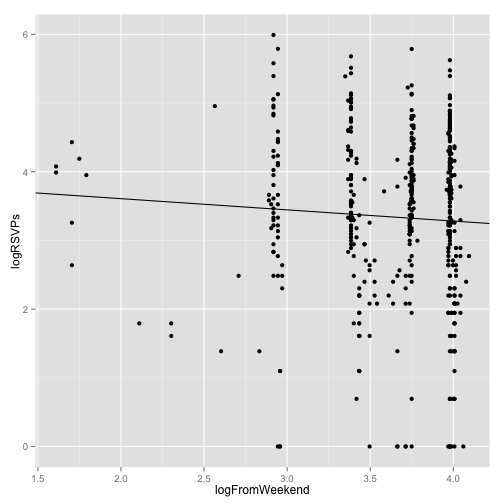 

```r
events$logFromWeekendModelPred = predict(logFromWeekendModel, events)
events$logFromWeekendModelPredResiduals = events$logFromWeekendModelPred - events$logRSVPs

cor(events$logFromWeekendModelPred, events$logRSVPs)
```

```
## [1] 0.05857261
```

```r
ggplot(aes(x = logFromWeekendModelPred , y = logFromWeekendModelPredResiduals), data = events) + 
  geom_point()
```

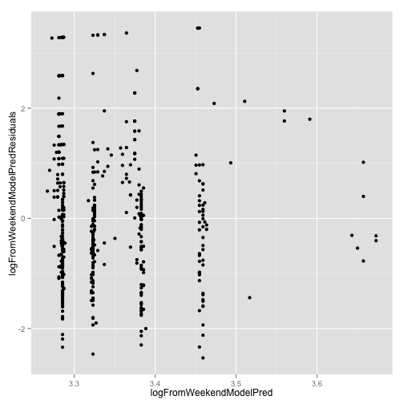 
