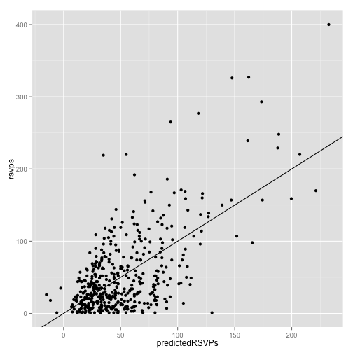
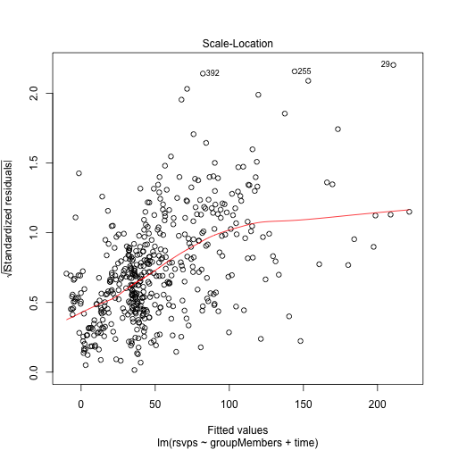
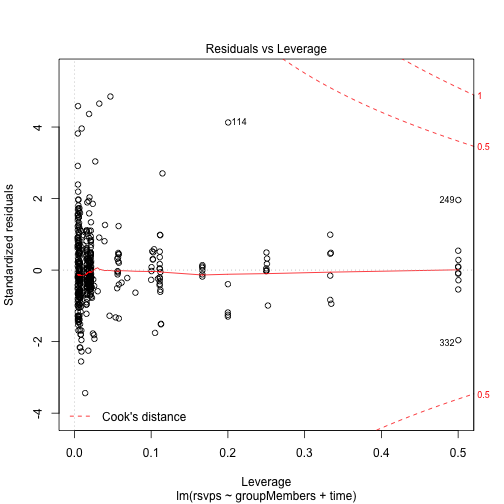
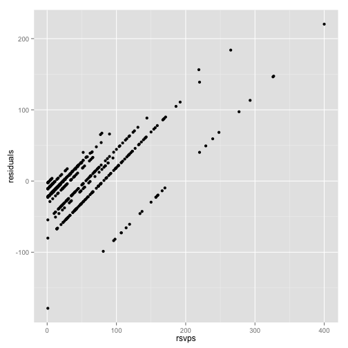
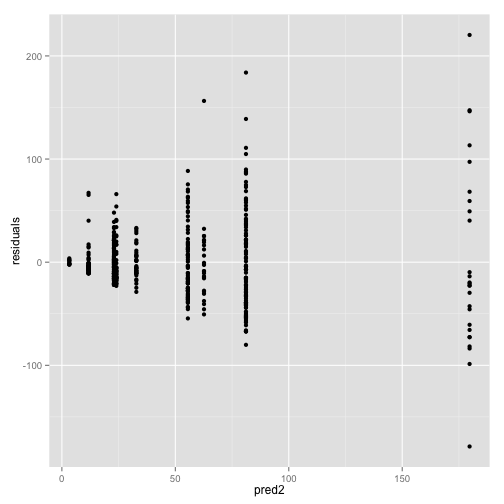
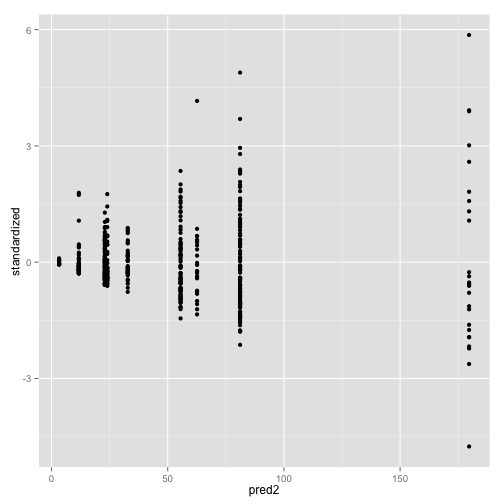

```r
library(RNeo4j)
library(dplyr)
library(car)
library(geosphere)
library(ggplot2)

graph = startGraph("http://localhost:7574/db/data/")
timestampToDate = function(x) as.POSIXct(x / 1000, origin="1970-01-01", tz = "GMT")
```


```r
# london nosql events
query = "MATCH (g:Group)-[:HOSTED_EVENT]->(event)<-[:TO]-({response: 'yes'})<-[:RSVPD]-(),
               (event)-[:HELD_AT]->(venue)
         WHERE (event.time + event.utc_offset) < timestamp()
         RETURN g.name, 
                event.time + event.utc_offset AS eventTime,
                event.name, 
                COUNT(*) AS rsvps, 
                venue.name AS venue,
                venue.lat AS lat,
                venue.lon AS lon"

events = cypher(graph, query)
events$eventTime <- timestampToDate(events$eventTime)
events$time = format(events$eventTime, "%H:%M")
events$day <- format(events$eventTime, "%A")
events$monthYear <- format(events$eventTime, "%m-%Y")
events$month <- factor(format(events$eventTime, "%B"), levels = month.name)
events$year <- format(events$eventTime, "%Y")
events %>% head()
```

```
##                            g.name           eventTime
## 1                 Big Data London 2013-02-20 18:30:00
## 2             DeNormalised London 2012-03-20 18:30:00
## 3       Neo4j - London User Group 2011-09-28 18:30:00
## 4                      MEAN Stack 2014-06-11 18:00:00
## 5             Data Science London 2013-03-28 18:30:00
## 6 London ElasticSearch User Group 2013-06-24 18:30:00
##                                           event.name rsvps
## 1   16th Big Data London Meetup - Big Data and Media   121
## 2                          First DeNormalised Meetup    24
## 3                Neo4j and Spring - Practical Primer     2
## 4                          Midweek MEAN Stack meetup    52
## 5                   Neural Networks and Data Science   171
## 6 June meetup: Elasticsearch at Rangespan and Exonar    56
##                                                       venue      lat
## 1                          Channel 4 Television Corporation 51.49576
## 2                                             Skills Matter 51.52451
## 3                                             Skills Matter 51.52482
## 4                                             Skills Matter 51.52451
## 5                                       The Hub Westminster 51.50790
## 6 Alumni Theatre, Lower Ground Floor, New Academic Building 51.51531
##         lon  time       day monthYear     month year
## 1 -0.133237 18:30 Wednesday   02-2013  February 2013
## 2 -0.099152 18:30   Tuesday   03-2012     March 2012
## 3 -0.099109 18:30 Wednesday   09-2011 September 2011
## 4 -0.099152 18:00 Wednesday   06-2014      June 2014
## 5 -0.131782 18:30  Thursday   03-2013     March 2013
## 6 -0.117738 18:30    Monday   06-2013      June 2013
```

## Is the RSVP data normally distributed?


```r
shapiro.test(events$rsvps)
```

```
## 
## 	Shapiro-Wilk normality test
## 
## data:  events$rsvps
## W = 0.7756, p-value < 2.2e-16
```

```r
ggplot(aes(x = rsvps), data = events) + geom_histogram(binwidth = 10)
```

 


```r
query = "MATCH (g:Group)<-[:MEMBER_OF]-()
WITH g, COUNT(*) AS max
ORDER BY max DESC
match (:Person)-[:HAS_MEETUP_PROFILE]->()-[:HAS_MEMBERSHIP]->(membership)-[:OF_GROUP]->(g:Group)
RETURN g.name, membership.joined AS joinTimestamp, max"
meetupMembers = cypher(graph, query)
meetupMembers$joinDate <- timestampToDate(meetupMembers$joinTimestamp)
meetupMembers$dayMonthYear <- as.Date(meetupMembers$joinDate)

cumulativeMeetupMembers = meetupMembers %>% 
  group_by(g.name, dayMonthYear) %>% 
  summarise(n = n()) %>%
  mutate(n = cumsum(n))

memberCount = function(meetupMembers) {
  function(groupName, date) {
    (meetupMembers %>% 
       filter(g.name == groupName & dayMonthYear < date) %>% do(tail(., 1)))$n    
  }  
} 

findMemberCount = memberCount(cumulativeMeetupMembers)

membersWithGroupCounts= events %>%
  mutate(
    groupMembers = by(events, 1:nrow(events), function(row) { 
        findMemberCount(row$g.name, as.character(row$eventTime))
      }) %>% 
      cbind() %>% 
      as.vector()    
    )

membersWithGroupCounts %>% 
  filter(g.name == "Neo4j - London User Group") %>% 
  arrange(eventTime) %>%
  select(rsvps, groupMembers, month, year) %>%
  sample_n(10)
```

```
##    rsvps groupMembers    month year
## 5      2           18  October 2011
## 24    62          271 February 2013
## 67    41         1188     June 2014
## 95     8         1702 December 2014
## 86    42         1605  October 2014
## 43    19          694  January 2014
## 49    42          835    March 2014
## 19    40          171 November 2012
## 22    63          217  January 2013
## 18    25          170 November 2012
```

```r
with(membersWithGroupCounts, cor(rsvps, groupMembers))
```

```
## [1] 0.6156347
```

```r
write.csv(membersWithGroupCounts, "/tmp/membersWithGroupCounts.csv")

ggplot(aes(x = groupMembers, y = rsvps), data = membersWithGroupCounts) + 
  geom_point()
```

 

membersWithGroupCounts %>% head()


```r
plotPredictedActual = function(data, x = "predictedRSVPs", y = "rsvps") {
  ggplot(aes_string(x = x, y = y), data = data) + 
  geom_point() + 
  geom_abline(intercept=0, slope=1)
}

fit = lm(rsvps ~ groupMembers, data = membersWithGroupCounts)
summary(fit)
```

```
## 
## Call:
## lm(formula = rsvps ~ groupMembers, data = membersWithGroupCounts)
## 
## Residuals:
##      Min       1Q   Median       3Q      Max 
## -127.379  -26.281   -7.168   20.293  195.707 
## 
## Coefficients:
##               Estimate Std. Error t value Pr(>|t|)    
## (Intercept)  18.512226   2.758435   6.711  5.5e-11 ***
## groupMembers  0.053050   0.003112  17.044  < 2e-16 ***
## ---
## Signif. codes:  0 '***' 0.001 '**' 0.01 '*' 0.05 '.' 0.1 ' ' 1
## 
## Residual standard error: 43.27 on 476 degrees of freedom
## Multiple R-squared:  0.379,	Adjusted R-squared:  0.3777 
## F-statistic: 290.5 on 1 and 476 DF,  p-value: < 2.2e-16
```

```r
membersWithGroupCounts$predictedRSVPs = predict(fit, membersWithGroupCounts)
plotPredictedActual(membersWithGroupCounts, "predictedRSVPs", "rsvps")
```

 


```r
fit = lm(rsvps ~ groupMembers + month, data = membersWithGroupCounts)
summary(fit)
```

```
## 
## Call:
## lm(formula = rsvps ~ groupMembers + month, data = membersWithGroupCounts)
## 
## Residuals:
##      Min       1Q   Median       3Q      Max 
## -127.555  -25.607   -5.774   21.631  194.933 
## 
## Coefficients:
##                  Estimate Std. Error t value Pr(>|t|)    
## (Intercept)     24.288080   9.288825   2.615  0.00922 ** 
## groupMembers     0.053468   0.003136  17.049  < 2e-16 ***
## monthFebruary   -2.772379  11.692498  -0.237  0.81268    
## monthMarch      -0.306424  12.030395  -0.025  0.97969    
## monthApril      -4.744350  11.026473  -0.430  0.66720    
## monthMay         2.396513  11.277244   0.213  0.83180    
## monthJune       -1.884691  11.415208  -0.165  0.86893    
## monthJuly      -11.481488  11.318453  -1.014  0.31092    
## monthAugust    -17.749864  12.027261  -1.476  0.14067    
## monthSeptember -10.064923  10.953704  -0.919  0.35865    
## monthOctober    -6.464559  10.739280  -0.602  0.54750    
## monthNovember   -1.526606  11.108085  -0.137  0.89075    
## monthDecember  -35.567735  14.804198  -2.403  0.01667 *  
## ---
## Signif. codes:  0 '***' 0.001 '**' 0.01 '*' 0.05 '.' 0.1 ' ' 1
## 
## Residual standard error: 43.14 on 465 degrees of freedom
## Multiple R-squared:  0.3969,	Adjusted R-squared:  0.3814 
## F-statistic:  25.5 on 12 and 465 DF,  p-value: < 2.2e-16
```

```r
membersWithGroupCounts$predictedRSVPs = predict(fit, membersWithGroupCounts)
plotPredictedActual(membersWithGroupCounts)
```

 


```r
fit = lm(rsvps ~ groupMembers + day + month, data = membersWithGroupCounts)
summary(fit)
```

```
## 
## Call:
## lm(formula = rsvps ~ groupMembers + day + month, data = membersWithGroupCounts)
## 
## Residuals:
##      Min       1Q   Median       3Q      Max 
## -129.078  -26.242   -6.162   19.464  184.111 
## 
## Coefficients:
##                  Estimate Std. Error t value Pr(>|t|)    
## (Intercept)     26.555962  15.968636   1.663  0.09699 .  
## groupMembers     0.055201   0.003174  17.391  < 2e-16 ***
## dayMonday       18.899959  14.757718   1.281  0.20095    
## daySaturday    -21.699351  19.965498  -1.087  0.27768    
## dayThursday     -7.062474  14.412275  -0.490  0.62434    
## dayTuesday      -6.036216  14.218376  -0.425  0.67137    
## dayWednesday    -4.504232  13.982084  -0.322  0.74749    
## monthFebruary   -3.063076  11.556175  -0.265  0.79108    
## monthMarch       1.602478  11.921923   0.134  0.89313    
## monthApril      -5.653742  10.898158  -0.519  0.60416    
## monthMay         1.011854  11.152421   0.091  0.92775    
## monthJune       -3.237976  11.281420  -0.287  0.77423    
## monthJuly      -10.767911  11.193875  -0.962  0.33658    
## monthAugust    -15.266411  11.903614  -1.283  0.20031    
## monthSeptember -11.181634  10.826437  -1.033  0.30224    
## monthOctober    -6.295592  10.633152  -0.592  0.55409    
## monthNovember   -4.255888  11.013716  -0.386  0.69937    
## monthDecember  -38.891959  14.638561  -2.657  0.00816 ** 
## ---
## Signif. codes:  0 '***' 0.001 '**' 0.01 '*' 0.05 '.' 0.1 ' ' 1
## 
## Residual standard error: 42.56 on 460 degrees of freedom
## Multiple R-squared:  0.4194,	Adjusted R-squared:  0.3979 
## F-statistic: 19.55 on 17 and 460 DF,  p-value: < 2.2e-16
```

```r
membersWithGroupCounts$predictedRSVPs = predict(fit, membersWithGroupCounts)
plotPredictedActual(membersWithGroupCounts)
```

 


```r
fit = lm(rsvps ~ groupMembers + time, data = membersWithGroupCounts)
summary(fit)
```

```
## 
## Call:
## lm(formula = rsvps ~ groupMembers + time, data = membersWithGroupCounts)
## 
## Residuals:
##      Min       1Q   Median       3Q      Max 
## -136.433  -19.632   -4.097   15.907  189.325 
## 
## Coefficients:
##                Estimate Std. Error t value Pr(>|t|)    
## (Intercept)  -30.646373  40.019009  -0.766   0.4442    
## groupMembers   0.051182   0.003022  16.934   <2e-16 ***
## time08:00     23.350540  44.679402   0.523   0.6015    
## time08:30     37.862798  56.541998   0.670   0.5034    
## time09:00     22.788977  41.055688   0.555   0.5791    
## time09:30     77.291498  48.943812   1.579   0.1150    
## time10:00     17.924761  41.911076   0.428   0.6691    
## time10:30     28.636377  48.970568   0.585   0.5590    
## time11:00     37.138451  56.548563   0.657   0.5117    
## time12:00     33.694124  46.143423   0.730   0.4656    
## time13:00     87.773954  48.951992   1.793   0.0736 .  
## time14:00     22.187434  48.958897   0.453   0.6506    
## time15:00     15.488262  46.142911   0.336   0.7373    
## time15:45     -0.259934  48.942170  -0.005   0.9958    
## time16:00     23.389963  56.515949   0.414   0.6792    
## time16:30    -11.400001  43.179308  -0.264   0.7919    
## time17:00     20.052721  40.350332   0.497   0.6195    
## time17:30     49.725518  42.128149   1.180   0.2385    
## time18:00     43.612794  40.400187   1.080   0.2809    
## time18:15     51.071664  42.136550   1.212   0.2261    
## time18:30     62.081531  40.048397   1.550   0.1218    
## time18:45     61.768231  56.534721   1.093   0.2752    
## time19:00     62.458032  40.277724   1.551   0.1217    
## time19:15     20.068376  44.699749   0.449   0.6537    
## time19:30     83.914759  43.811558   1.915   0.0561 .  
## time20:00     44.146248  56.540650   0.781   0.4353    
## ---
## Signif. codes:  0 '***' 0.001 '**' 0.01 '*' 0.05 '.' 0.1 ' ' 1
## 
## Residual standard error: 39.96 on 452 degrees of freedom
## Multiple R-squared:  0.497,	Adjusted R-squared:  0.4692 
## F-statistic: 17.87 on 25 and 452 DF,  p-value: < 2.2e-16
```

```r
membersWithGroupCounts$predictedRSVPs = predict(fit, membersWithGroupCounts)
plotPredictedActual(membersWithGroupCounts)
```

 

```r
cor(membersWithGroupCounts$rsvps, membersWithGroupCounts$predictedRSVPs)
```

```
## [1] 0.7050118
```

```r
plot(fit)
```

```
## Warning: not plotting observations with leverage one:
##   9, 27, 210, 256, 265, 355
```

  

```
## Warning: not plotting observations with leverage one:
##   9, 27, 210, 256, 265, 355
```

  


```r
with(membersWithGroupCounts, cor(time, rsvps))
```

```
## Error in cor(time, rsvps): 'x' must be numeric
```


```r
membersWithGroupCounts %>% head()
```

```
##                            g.name           eventTime
## 1                 Big Data London 2013-02-20 18:30:00
## 2             DeNormalised London 2012-03-20 18:30:00
## 3       Neo4j - London User Group 2011-09-28 18:30:00
## 4                      MEAN Stack 2014-06-11 18:00:00
## 5             Data Science London 2013-03-28 18:30:00
## 6 London ElasticSearch User Group 2013-06-24 18:30:00
##                                           event.name rsvps
## 1   16th Big Data London Meetup - Big Data and Media   121
## 2                          First DeNormalised Meetup    24
## 3                Neo4j and Spring - Practical Primer     2
## 4                          Midweek MEAN Stack meetup    52
## 5                   Neural Networks and Data Science   171
## 6 June meetup: Elasticsearch at Rangespan and Exonar    56
##                                                       venue      lat
## 1                          Channel 4 Television Corporation 51.49576
## 2                                             Skills Matter 51.52451
## 3                                             Skills Matter 51.52482
## 4                                             Skills Matter 51.52451
## 5                                       The Hub Westminster 51.50790
## 6 Alumni Theatre, Lower Ground Floor, New Academic Building 51.51531
##         lon  time       day monthYear     month year groupMembers
## 1 -0.133237 18:30 Wednesday   02-2013  February 2013         1373
## 2 -0.099152 18:30   Tuesday   03-2012     March 2012           49
## 3 -0.099109 18:30 Wednesday   09-2011 September 2011           17
## 4 -0.099152 18:00 Wednesday   06-2014      June 2014          273
## 5 -0.131782 18:30  Thursday   03-2013     March 2013         1485
## 6 -0.117738 18:30    Monday   06-2013      June 2013           97
##   predictedRSVPs
## 1      101.70816
## 2       33.94308
## 3       32.30525
## 4       26.93913
## 5      107.44055
## 6       36.39982
```


```r
library(partykit)
```

```
## Loading required package: grid
```


```r
write.csv(membersWithGroupCounts, "/tmp/membersWithGroupCounts.csv")
membersWithGroupCounts = read.csv("/tmp/membersWithGroupCounts.csv")

library(gridExtra)
library(partykit)

model1 = lm(rsvps ~ groupMembers + time + month + day, data = membersWithGroupCounts)
membersWithGroupCounts$pred1 = predict(model1, membersWithGroupCounts)
model1Plot = plotPredictedActual(membersWithGroupCounts, "pred1")
cor(membersWithGroupCounts$rsvps, membersWithGroupCounts$pred1)
```

```
## [1] 0.7250217
```

```r
model2 = ctree(rsvps ~ groupMembers + factor(time) + factor(month) + factor(day),  
               data = membersWithGroupCounts)
membersWithGroupCounts$pred2 = predict(model2, membersWithGroupCounts)
cor(membersWithGroupCounts$rsvps, membersWithGroupCounts$pred2)
```

```
## [1] 0.7283527
```

```r
model2Plot = plotPredictedActual(membersWithGroupCounts, "pred2")

grid.arrange(model1Plot,model2Plot, ncol = 1)
```

 

```r
membersWithGroupCounts %>% select(g.name, day, month, time, groupMembers, rsvps, pred2) %>% sample_n(10)
```

```
##                                                 g.name       day    month
## 45                           Neo4j - London User Group  Thursday    April
## 452                          London MongoDB User Group Wednesday     June
## 460                    London ElasticSearch User Group Wednesday     June
## 186 The London Distributed Graph Database Meetup Group   Tuesday   August
## 386                          London MongoDB User Group Wednesday     July
## 306                                       London NoSQL  Saturday      May
## 147                              Hadoop Users Group UK    Monday November
## 252                        MarkLogic User Group London  Thursday November
## 71                               Hadoop Users Group UK  Thursday     June
## 464                              Hadoop Users Group UK    Monday November
##      time groupMembers rsvps     pred2
## 45  18:30          913    27  81.13636
## 452 18:30         1242    57  81.13636
## 460 17:00          527    52  11.76471
## 186 10:00           55     9  22.96078
## 386 18:00         1248     1  24.00000
## 306 10:00          271    21  11.76471
## 147 19:00          616    85  81.13636
## 252 18:30          199    35  55.53333
## 71  18:30          466   113  55.53333
## 464 18:30         1916   157 179.69231
```

```r
membersWithGroupCounts %>% select(g.name, day, month, time, groupMembers, rsvps, pred2) %>% filter(pred2 > 79 & pred2 < 85)
```

```
##                              g.name       day     month  time groupMembers
## 1                   Big Data London Wednesday  February 18:30         1373
## 2               Data Science London  Thursday     March 18:30         1485
## 3               Data Science London   Tuesday   October 18:30          868
## 4         Neo4j - London User Group Wednesday   October 18:30          575
## 5         London MongoDB User Group  Thursday   October 18:30          983
## 6         Neo4j - London User Group   Tuesday       May 18:30         1055
## 7               Data Science London   Tuesday  February 18:30         1248
## 8                  Cassandra London    Monday  November 18:30         1227
## 9                   Big Data London    Monday  December 19:00         1141
## 10        London MongoDB User Group   Tuesday     April 18:30          803
## 11        Neo4j - London User Group Wednesday September 18:30         1532
## 12            Hadoop Users Group UK    Monday  November 19:00         1183
## 13        Neo4j - London User Group  Thursday     April 18:30          913
## 14        Neo4j - London User Group Wednesday     April 18:30          990
## 15        London MongoDB User Group  Thursday   January 19:00          666
## 16        London MongoDB User Group Wednesday  November 17:30         1016
## 17  London ElasticSearch User Group Wednesday September 18:30          601
## 18              Data Science London  Thursday   October 18:30          939
## 19        Neo4j - London User Group Wednesday      June 18:30         1150
## 20        Neo4j - London User Group   Tuesday September 18:30         1523
## 21        London MongoDB User Group Wednesday  December 19:00          599
## 22            Hadoop Users Group UK  Thursday     April 18:30         1429
## 23        Neo4j - London User Group  Thursday     April 18:30          966
## 24            Hadoop Users Group UK  Thursday  November 19:00          632
## 25            Hadoop Users Group UK   Tuesday  February 18:30         1327
## 26                 Cassandra London    Monday     April 19:00          850
## 27        London MongoDB User Group Wednesday  December 17:30         1025
## 28    Big Data Developers in London Wednesday    August 18:30          599
## 29        Neo4j - London User Group   Tuesday      June 18:30         1188
## 30                 Cassandra London  Thursday September 19:00         1084
## 31        Neo4j - London User Group   Tuesday      July 18:30         1277
## 32        Neo4j - London User Group   Tuesday September 18:30         1549
## 33            Hadoop Users Group UK    Monday  November 19:00          616
## 34              Data Science London  Saturday      July 09:30          677
## 35        Neo4j - London User Group   Tuesday     March 18:30          835
## 36                  Big Data London    Monday     April 18:30         1583
## 37        Neo4j - London User Group Wednesday    August 18:30         1359
## 38              Data Science London  Thursday September 18:30          757
## 39        Neo4j - London User Group Wednesday   October 18:30         1649
## 40        London MongoDB User Group Wednesday     March 18:30         1134
## 41            Hadoop Users Group UK Wednesday     April 18:30          753
## 42        Neo4j - London User Group  Thursday    August 18:30         1388
## 43                  Big Data London   Tuesday   January 17:30         1275
## 44        Neo4j - London User Group  Thursday      June 18:30         1156
## 45                  Big Data London    Friday     April 19:00          585
## 46              Data Science London Wednesday     April 18:30         1640
## 47        Neo4j - London User Group   Tuesday     March 18:30          862
## 48        London MongoDB User Group   Tuesday       May 18:30          837
## 49        London MongoDB User Group   Tuesday     March 18:30          750
## 50                 Cassandra London Wednesday   October 18:30          709
## 51            Hadoop Users Group UK Wednesday      June 18:30          867
## 52            Hadoop Users Group UK  Thursday      July 18:30          954
## 53        Neo4j - London User Group   Tuesday   October 18:30         1581
## 54        Neo4j - London User Group  Thursday  November 18:30         1675
## 55              Data Science London    Monday       May 13:00          577
## 56        Neo4j - London User Group Wednesday  February 18:30          785
## 57            Hadoop Users Group UK Wednesday   October 19:00          571
## 58                 Cassandra London Wednesday    August 19:00         1040
## 59        Neo4j - London User Group Wednesday      July 18:30         1225
## 60                  Big Data London    Monday       May 18:30          652
## 61              Data Science London Wednesday September 18:30          801
## 62        Neo4j - London User Group Wednesday      June 18:30         1108
## 63              Data Science London  Thursday  February 18:30         1286
## 64        London MongoDB User Group Wednesday  December 19:00         1054
## 65        Neo4j - London User Group Wednesday      July 18:30         1335
## 66              Data Science London  Thursday     March 18:30         1375
## 67        Neo4j - London User Group Wednesday September 18:30         1453
## 68        London MongoDB User Group   Tuesday      June 18:30          865
## 69        Neo4j - London User Group   Tuesday   October 18:30         1625
## 70        Neo4j - London User Group  Thursday       May 18:30         1066
## 71                 Cassandra London   Tuesday  February 19:00          768
## 72        Neo4j - London User Group   Tuesday   October 18:30         1605
## 73        London MongoDB User Group   Tuesday  February 18:30          706
## 74                  Big Data London Wednesday September 18:30          895
## 75              Data Science London Wednesday  November 18:30         1033
## 76        Neo4j - London User Group  Thursday    August 18:30         1418
## 77        Neo4j - London User Group Wednesday  November 18:30         1687
## 78        Neo4j - London User Group Wednesday  December 18:30         1702
## 79        Neo4j - London User Group Wednesday September 18:30         1497
## 80        Neo4j - London User Group   Tuesday      July 18:30         1249
## 81            Hadoop Users Group UK   Tuesday       May 18:30          812
## 82        Neo4j - London User Group Wednesday     March 18:30          870
## 83                 Cassandra London   Tuesday      July 19:00          992
## 84                  Big Data London   Tuesday      July 18:30          749
## 85        London MongoDB User Group Wednesday       May 18:30         1211
## 86                 Cassandra London   Tuesday      June 19:00          956
## 87        Neo4j - London User Group Wednesday   January 18:30          700
## 88        Neo4j - London User Group Wednesday      June 18:30         1195
## 89        Neo4j - London User Group   Tuesday     April 18:30          936
## 90        Neo4j - London User Group  Thursday September 18:30         1458
## 91            Hadoop Users Group UK   Tuesday   October 18:30         1130
## 92        Neo4j - London User Group   Tuesday      July 18:30         1306
## 93                  Big Data London    Monday   October 18:30          991
## 94        London MongoDB User Group   Tuesday  November 18:30          585
## 95        Neo4j - London User Group  Thursday       May 18:30         1007
## 96            Hadoop Users Group UK   Tuesday September 19:00         1037
## 97                 Cassandra London  Thursday   October 19:00         1134
## 98        Neo4j - London User Group Wednesday  November 19:00         1702
## 99        Neo4j - London User Group   Tuesday      June 18:30         1125
## 100       Neo4j - London User Group   Tuesday     April 18:30          982
## 101       Neo4j - London User Group  Thursday   October 18:30         1591
## 102       London MongoDB User Group Wednesday     April 18:30         1164
## 103       Neo4j - London User Group   Tuesday   October 18:30         1645
## 104       Neo4j - London User Group   Tuesday       May 18:30         1025
## 105       London MongoDB User Group Wednesday September 18:30          940
## 106                 Big Data London    Monday     April 18:30          570
## 107             Data Science London Wednesday   January 18:30         1143
## 108       London MongoDB User Group Wednesday      June 18:30         1242
## 109       Neo4j - London User Group Wednesday    August 18:30         1436
## 110                Cassandra London  Thursday       May 19:00          922
##     rsvps    pred2
## 1     121 81.13636
## 2     171 81.13636
## 3     192 81.13636
## 4      55 81.13636
## 5      74 81.13636
## 6      52 81.13636
## 7     123 81.13636
## 8     143 81.13636
## 9       1 81.13636
## 10     77 81.13636
## 11    102 81.13636
## 12    169 81.13636
## 13     27 81.13636
## 14     91 81.13636
## 15     28 81.13636
## 16     14 81.13636
## 17    107 81.13636
## 18    115 81.13636
## 19     23 81.13636
## 20     23 81.13636
## 21     14 81.13636
## 22    150 81.13636
## 23     30 81.13636
## 24     65 81.13636
## 25    118 81.13636
## 26     98 81.13636
## 27     15 81.13636
## 28     71 81.13636
## 29     41 81.13636
## 30    100 81.13636
## 31     39 81.13636
## 32     74 81.13636
## 33     85 81.13636
## 34     66 81.13636
## 35     42 81.13636
## 36    139 81.13636
## 37     59 81.13636
## 38    119 81.13636
## 39     89 81.13636
## 40     77 81.13636
## 41     31 81.13636
## 42     52 81.13636
## 43    186 81.13636
## 44     33 81.13636
## 45     59 81.13636
## 46    159 81.13636
## 47     55 81.13636
## 48     48 81.13636
## 49     53 81.13636
## 50    220 81.13636
## 51    112 81.13636
## 52    141 81.13636
## 53     66 81.13636
## 54     50 81.13636
## 55    142 81.13636
## 56     99 81.13636
## 57     42 81.13636
## 58     74 81.13636
## 59     40 81.13636
## 60    127 81.13636
## 61    109 81.13636
## 62     33 81.13636
## 63    136 81.13636
## 64     96 81.13636
## 65    103 81.13636
## 66    167 81.13636
## 67     39 81.13636
## 68     29 81.13636
## 69     74 81.13636
## 70     25 81.13636
## 71     77 81.13636
## 72     42 81.13636
## 73     65 81.13636
## 74    133 81.13636
## 75    117 81.13636
## 76     49 81.13636
## 77     40 81.13636
## 78     28 81.13636
## 79     48 81.13636
## 80     37 81.13636
## 81    107 81.13636
## 82    103 81.13636
## 83    123 81.13636
## 84     62 81.13636
## 85     64 81.13636
## 86     82 81.13636
## 87     92 81.13636
## 88     85 81.13636
## 89     44 81.13636
## 90     20 81.13636
## 91    168 81.13636
## 92     46 81.13636
## 93    265 81.13636
## 94     86 81.13636
## 95     27 81.13636
## 96    103 81.13636
## 97     99 81.13636
## 98     49 81.13636
## 99     37 81.13636
## 100    42 81.13636
## 101    41 81.13636
## 102    78 81.13636
## 103    14 81.13636
## 104    29 81.13636
## 105    59 81.13636
## 106   156 81.13636
## 107   132 81.13636
## 108    57 81.13636
## 109    66 81.13636
## 110   154 81.13636
```

```r
plot(model2)
```

 


```r
membersWithGroupCounts$residuals = membersWithGroupCounts$rsvps - membersWithGroupCounts$pred2
ggplot(aes(x = rsvps, y = residuals), data = membersWithGroupCounts) + geom_point()
```

 

```r
ggplot(aes(x = pred2, y = residuals), data = membersWithGroupCounts) + geom_point()
```

 

```r
membersWithGroupCounts$standardized = membersWithGroupCounts$residuals / sd(membersWithGroupCounts$residuals)
ggplot(aes(x = rsvps , y = standardized), data = membersWithGroupCounts) + geom_point()
```

 

```r
ggplot(aes(x = pred2 , y = standardized), data = membersWithGroupCounts) + geom_point()
```

 
