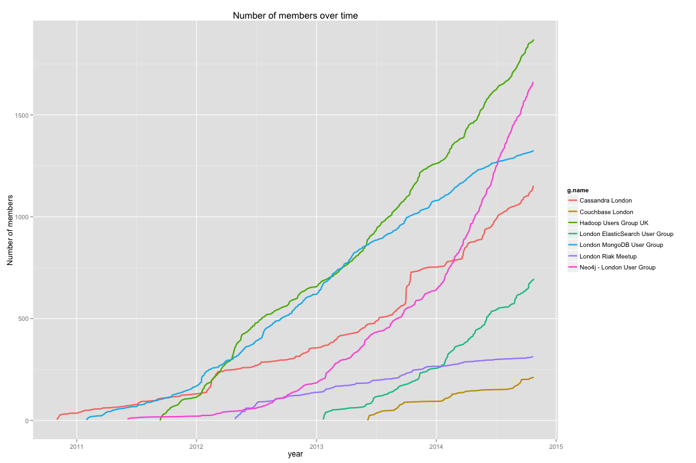

Comparing London #nosql group membership over time
========================================================

First we query Neo4j to get the groups + memberships:


```r
library(RNeo4j)
library(dplyr)
library(ggplot2)

graph = startGraph("http://localhost:7478/db/data/")

# get member sign up times
query = "match (:Person)-[:HAS_MEETUP_PROFILE]->()-[:HAS_MEMBERSHIP]->(membership)-[:OF_GROUP]->(g:Group)
RETURN g.name, membership.joined AS joinTimestamp"

timestampToDate <- function(x) as.POSIXct(x / 1000, origin="1970-01-01", tz = "GMT")
meetupMembers = cypher(graph, query)
meetupMembers$joinDate <- timestampToDate(meetupMembers$joinTimestamp)
meetupMembers$dayMonthYear <- as.Date(meetupMembers$joinDate)
```

And now let's aggregate and plot that:


```r
cumulativeMeetupMembers = meetupMembers %>%
  group_by(g.name, dayMonthYear) %>%
  summarise(n = n()) %>%
  mutate(n = cumsum(n))

filteredCumulativeMeetupMembers = cumulativeMeetupMembers %>%
  group_by(g.name) %>%
  mutate(total = max(n)) %>%
  ungroup() %>%
  mutate(min.total.of.interest = sort(unique(total), decreasing=T)[5]) %>%
  filter(total >= min.total.of.interest)
```


```r
ggplot(aes(x = dayMonthYear, y = n, color = g.name), data = filteredCumulativeMeetupMembers) + 
  geom_line(size = 1) +
  xlab("year") + ylab("Number of members") + ggtitle("Number of members over time")
```

 


```r
databases = c("London MongoDB User Group", "Neo4j - London User Group", "London Riak Meetup", "Hadoop Users Group UK", "Cassandra London", "Couchbase London", "London ElasticSearch User Group")
ggplot(aes(x = dayMonthYear, y = n, color = g.name), data = cumulativeMeetupMembers %>% filter(g.name %in% databases)) + 
  geom_line(size = 1) +
  xlab("year") + ylab("Number of members") + ggtitle("Number of members over time")
```

 

