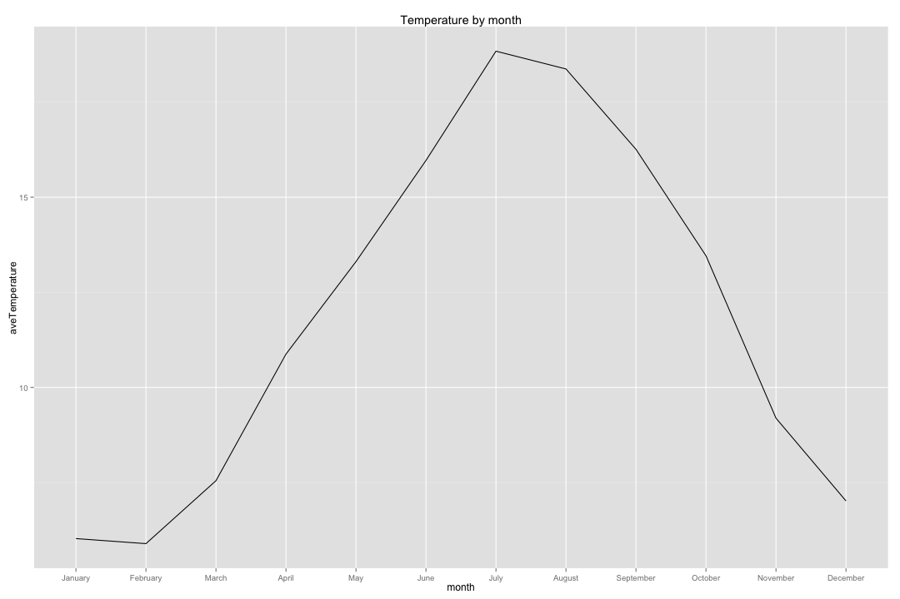

```r
setwd("~/projects/neo4j-meetup/rScripts")
library(weatherData)
library(dplyr)
library(ggplot2)
```


```r
getDetailedWeatherForYear = function(year) {
  getWeatherForDate("LCY", 
                    start_date= paste(sep="", year, "-01-01"),
                    end_date = paste(sep="", year, "-12-31"),
                    opt_detailed = FALSE,
                    opt_all_columns = TRUE)
}


# df = rbind(getDetailedWeatherForYear(2011), 
#       getDetailedWeatherForYear(2012),
#       getDetailedWeatherForYear(2013),
#       getDetailedWeatherForYear(2014),
#       getWeatherForDate("LCY", start_date="2015-01-01",
#                         end_date = "2015-01-25",
#                         opt_detailed = FALSE,
#                         opt_all_columns = TRUE))
# 
# 
# write.csv(df, 'weather/temp_data.csv', row.names = FALSE)

weather = read.csv("weather/temp_data.csv")
weather$Date = as.POSIXct(weather$Date)

weather %>% select(Date, Mean_TemperatureC) %>% sample_n(10)
```

```
##            Date Mean_TemperatureC
## 1248 2014-06-01                18
## 1094 2013-12-29                 6
## 190  2011-07-09                17
## 900  2013-06-18                17
## 668  2012-10-29                10
## 935  2013-07-23                24
## 53   2011-02-22                 6
## 493  2012-05-07                10
## 302  2011-10-29                14
## 910  2013-06-28                17
```

```r
averageTemperatureByMonth = weather %>% 
  mutate(month = factor(format(Date, "%B"), levels=month.name)) %>%
  group_by(month) %>% 
  summarise(aveTemperature = mean(Mean_TemperatureC))
```


```r
ggplot(aes(x = month, y = aveTemperature, group=1), data = averageTemperatureByMonth) + 
  geom_line( ) + 
  ggtitle("Temperature by month")
```

 
